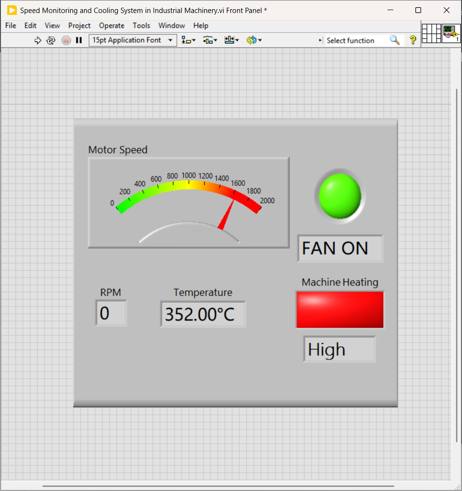
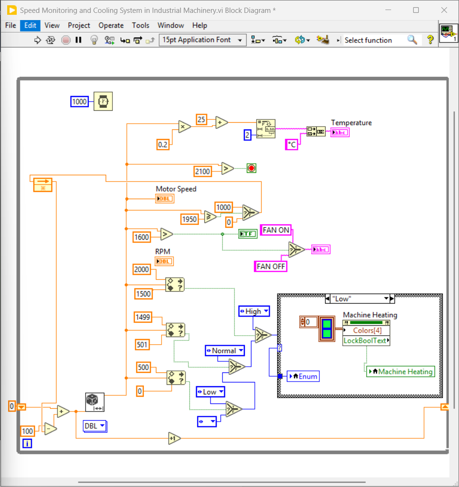

# Speed Monitoring and Cooling System in Industrial Machinery

A LabVIEW-based industrial monitoring system designed to monitor **motor speed, RPM, and machine temperature** while controlling a cooling fan according to predefined operating conditions.

The system uses simulated machine parameters and LabVIEW graphical programming to demonstrate a basic industrial monitoring and control application.

## Features

- Real-time motor speed monitoring
- RPM measurement and display
- Analog motor-speed gauge
- Machine temperature monitoring
- Temperature status indication
- Automatic cooling fan control
- FAN ON / FAN OFF indication
- High-speed condition detection
- Continuous machine monitoring
- Simulated industrial operating conditions

## Project Objective

The objective of this project is to develop a simple monitoring and control system that can:

- Monitor the speed of an industrial motor.
- Display the motor speed in RPM.
- Monitor machine temperature.
- Identify different machine heating conditions.
- Automatically control the cooling fan.
- Provide clear visual feedback to the operator.

## Technology

- **LabVIEW**
- Graphical Programming

## System Working

The system continuously generates and monitors simulated machine parameters inside a LabVIEW While Loop.

### Motor Speed Monitoring

The motor speed is monitored continuously and displayed in two forms:

- Numerical RPM value
- Analog speed gauge

The speed is compared with predefined threshold values to determine the operating condition of the motor.

### Cooling Fan Control

The motor speed is evaluated against predefined limits.

When the required condition is detected, the cooling fan is activated automatically.

The current fan condition is displayed on the Front Panel as:

- **FAN ON**
- **FAN OFF**

### Temperature Monitoring

The system calculates and displays the machine temperature in degrees Celsius.

The temperature condition is classified into:

- **Low**
- **Normal**
- **High**

The corresponding condition is displayed using the Machine Heating indicator.

## Front Panel

The Front Panel provides an industrial-style monitoring interface containing:

- Motor Speed Gauge
- RPM Indicator
- Temperature Indicator
- FAN Status
- Machine Heating Indicator
- Temperature Status

### Front Panel



## Block Diagram

The Block Diagram contains the main monitoring and control logic implemented using LabVIEW graphical programming.

### Block Diagram



## LabVIEW Implementation

The system is implemented using several core LabVIEW programming concepts.

### Programming Structures

- While Loop for continuous monitoring
- Shift Register for maintaining values between loop iterations
- Comparison functions for threshold detection
- Arithmetic functions for parameter calculations
- Select functions for control decisions
- Case Structure for machine-condition handling
- Boolean logic for FAN control
- Timing functions for controlled execution
- String conversion for displaying temperature information

## Control Logic

The basic control flow of the system is:

```text
Simulated Machine Parameters
            ↓
      Motor Speed / RPM
            ↓
    Threshold Comparison
            ↓
     Machine Condition
            ↓
      Cooling Decision
        ↙          ↘
    FAN ON        FAN OFF
            ↓
     Update Indicators
            ↓
       Repeat Loop
```
- Industrial Monitoring & Control
- Simulation
- Data Visualization
